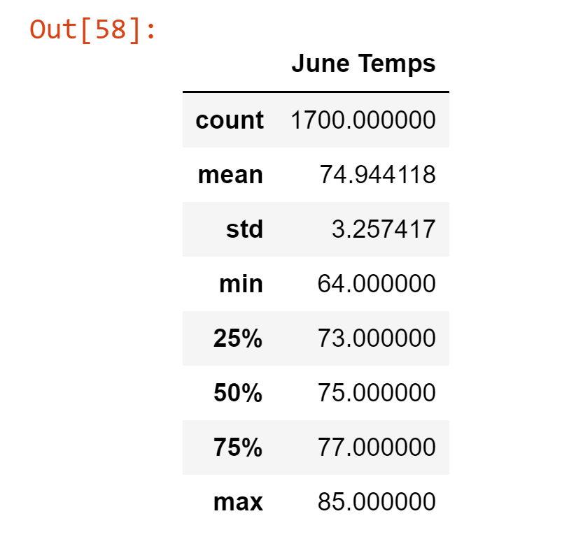

# Surfs Up
## Overview
The purpose of this analysis is to provide the primary surf and ice cream shop stakeholder/investor information about temperature trends before opening the surf shop. Specifically, he wants temperature data for the months of June and December in Oahu, in order to determine if the business is sustainable year-round.

## Results
 - The maximum June temperature recorded was 85 degrees while December's maximum recorded was 83 degrees.
 - The minimum June temperature recorded was 64 degrees while December's minimum recorded was 56 degrees.
 - The average temperature recorded was 74.9 degrees for June and 71 degrees for December.
### Data 
 - 
 - 

## Summary
The maximum temperatures for both months were within 2 degrees of each other and seem ideal for surfing and enjoying ice cream. However, the low temperatures, at 64 and 56 degrees respectively, may be on the cold side for ice cream consumption by patrons.  Regarding surfing, the surf shop would find it beneficial to have an inventory of wetsuits for both rental and sale, to help surfers make their surfing experience more enjoyable during December.  The standard deviation is 3.3 degrees for June and 3.7 degrees for December, revealing stable temperatures, which will be helpful to the stakeholder as he finalizes his decision on whether to proceed.

## Additional Queries
### Precipitation
Taking the analysis further, precipitation data could be gathered and analyzed to determine the rainfall levels in both June and December, in conjunction with the temperature data. This would provide the stakeholder insight into a potential rainy season, which could cause a decrease in both the surf shop and ice cream sales.
### Stations
Weather station data is available. It would be interesting to analyze the station information to see which station records the most data, which station is closest to shore (and therefore potentially more relevant) and how this affects our overall analysis.  Viewing the temperature and precipitation data by station may be a valuable exercise in providing further insight into the data and allowing the stakeholder to make a more informed decision.
